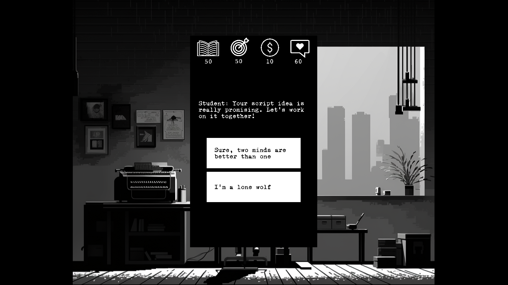

## Contexte de création

« Screenwriting Game » est un jeu de stratégie textuel où le joueur est amené à construire une carrière de scénariste. Conçu initialement dans le cadre du cours « Développement de jeux vidéo 2D », dispensé par Isaac Pante à l'Université de Lausanne, le jeu a été développé par la suite sous sa direction pour le cours « Projet en Informatique et Méthodes Mathématiques ». Le jeu a été créé avec Kaboom.js, une bibliothèque de programmation de jeux en JavaScript, que nous avons appris à maîtriser pendant le cours « Développement de jeux vidéo 2D ».

## Description du jeu

Le joueur endosse le rôle d'un scénariste en devenir, confronté à des choix importants qui influencent sa vie et sa carrière. Le cœur du jeu s'inspire de Reigns (Nerial, 2016): le joueur est placé devant un dilemme entre deux options dans diverses situations, présentées aléatoirement sous forme de textes. Chaque décision affecte quatre indicateurs clés. Pour réussir, le joueur doit maintenir un équilibre entre ces indicateurs et éviter les extrêmes : si un indicateur tombe en dessous de 0 ou excède 80 points, il perd. En fonction de l'indicateur concerné et de son extrême, le joueur sera confronté à différentes fins.

Le jeu se compose actuellement de deux niveaux : Film School Student et Aspiring Author . Les situations du premier niveau sont liées à la vie universitaire d'un étudiant en école de cinéma, tandis que le deuxième niveau représente l'étape suivante de sa carrière : après avoir terminé l'école de cinéma, il fait ses premiers pas dans le monde professionnel. Au premier niveau, les indicateurs à prendre en compte par le joueur sont : Ego pour la confiance en soi, Relationship pour les liens personnels et professionnels, Money pour les finances et University pour la réussite universitaire. Au deuxième niveau, l'indicateur University est remplacé par Fame, mesurant la reconnaissance publique.

Ce jeu appartient également à la catégorie des serious games, qui combine l’aspect ludique et objectifs pédagogiques. La dimension de médiation scientifique se manifeste à travers des quiz sur la dramaturgie et le métier de scénariste, intégrés de façon fluide dans le gameplay principal : après chaque série de cinq situations, le joueur est confronté à cinq questions de quiz. Pour le premier niveau, les quiz prennent la forme d'examens universitaires, tandis qu'au deuxième niveau, ils simulent un entretien d'embauche. À chaque niveau, le joueur peut se permettre jusqu'à deux erreurs dans ces quiz de médiation scientifique.

En cas d'échec au premier niveau, le joueur doit redémarrer le jeu depuis le début. S'il échoue au deuxième niveau, il a la possibilité de reprendre le jeu à partir de ce dernier.

## Sources des images

- Étoile https://ru.freepik.com/icon/web_10092762#fromView=search&term=clip+art+star+white+on+black+background&track=ais&page=1&position=23&uuid=8355a65a-9015-4c43-a827-14b4f352c0c9
- Livre https://www.freepik.com/icon/book_7952768#fromView=search&term=book+white+on+black+background&track=ais&page=1&position=43&uuid=578190ad-a380-4f0a-9f2c-2841d45f5c0c
- Dollar https://www.freepik.com/icon/money_11349216#fromView=search&term=dollar+clipart+white+on+black+backgroun&track=ais&page=1&position=0&uuid=b554b287-0326-41d5-8c35-7d19e837ef0c
- Cœur https://www.freepik.com/icon/chat_331343#fromView=search&term=love+clipart+white+on+black+backgroun&track=ais&page=1&position=60&uuid=bf3a65d8-4a44-4876-8570-47f9c8f2e5e8
- Cible ambition last source https://www.freepik.com/icon/target_4989967#fromView=search&term=ambition+clipart+white+on+black+backgroun&track=ais&page=1&position=1&uuid=0b8ff93d-d815-448b-83e4-072cfa670277
- Flèche https://ru.freepik.com/icon/arrow_11427331#fromView=search&term=clip+art+arrow+white+on+black+background&track=ais&page=1&position=16&uuid=66438c2f-91b5-4941-808f-30192110fc6d
- Image de fond: Créé avec Midjourney
